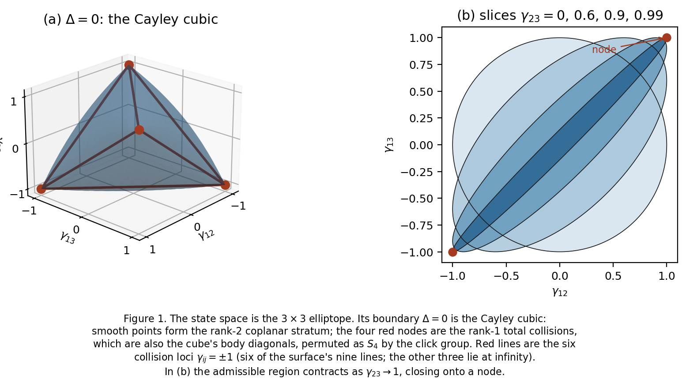
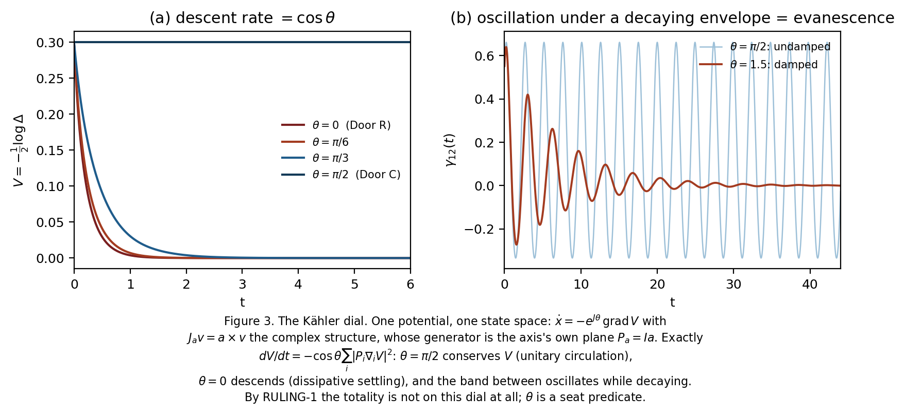
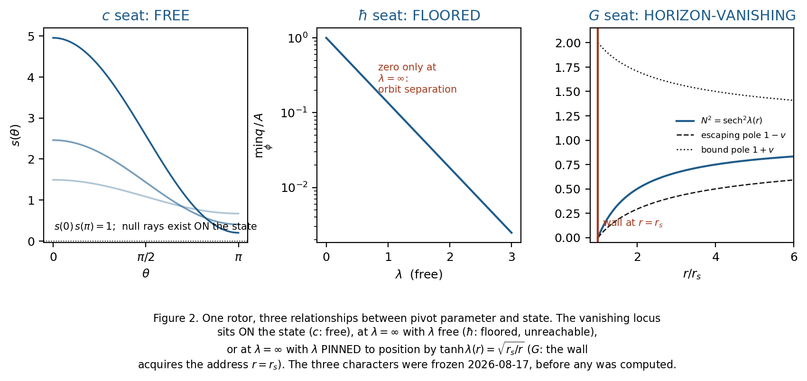

# The Seated Root
## How much physics follows from three axes through a point: a derivational-economy study with machine-verified receipts

**W. Lloyd** — draft v0.1, 2026-08-28
*All results in this paper are backed by exact symbolic computation committed to the project repository; commit hashes appear in §11.*

---

### Abstract

We study a deliberately minimal object: three polarized axes through a common
root, with state given by the Gram matrix $G$ of the axes, observers modelled
as *seats* (an observer occupies one axis, which becomes its unmeasurable
reference), and changes of perspective modelled as hyperbolic rotors
("pivots") in the Clifford algebra $\mathrm{Cl}(3)$. Under a strict
banned-input discipline — each derivation declares what it may not use, and
predictions are frozen with hashes before computation — this structure
reproduces a surprising amount of standard physics: the classical relativistic
temperature-transformation family and its resolution (with explicit ancestry
in Biró–Ván), the uncertainty floor of conjugate quadratures, the
horizon-vanishing structure of static gravitational observers, the Unruh and
Hawking temperatures *with their coefficients selected by an internal theorem
where a wrong coefficient was available*, an emergent-time architecture
consonant with Wheeler–DeWitt and Page–Wootters, and a derived (not posited)
seat-level dissipator obeying the fluctuation–dissipation theorem. The paper's
claim is **not** new physics: nearly every physical output is a retrodiction
with named lineage. The claim is *economy*: the input set is small, the
banned lists are enforced, several freeze-dated internal theorems later
selected correct coefficients unprompted, and the framework yields a small
number of new mathematical identities plus one prediction-shaped statement —
the medium of the model is readable as a Bargmann holonomy around the seat
cycle. Every theorem is machine-verified in exact arithmetic; every numeric
claim is corroborated to stated precision; every conjecture is labelled.

---

### 1. Introduction, and what kind of paper this is

The project's founding motivation is the representation of singular behaviour:
to build a state space in which "the singularity" is a locus with computable
structure rather than a place where one writes $\infty$. The resulting
programme has an unusual epistemology which we state up front, because the
paper is unreadable without it.

Every result below carries a tier label: **[proved]** (exact symbolic theorem,
machine-checked), **[derived | X]** (exact, conditional on a declared input X),
**[retrodiction]** (recovers known physics; lineage cited), **[conjecture]**,
or **[declared]** (an input, frozen and named, never silently assumed). Each
computation preregisters its predictions and kill conditions before running;
several documents in the corpus carry SHA-256 hashes frozen prior to
execution. Where possible, results are verified by two independent
computational routes sharing nothing but the computer-algebra system. The
outcome of any derivation is booked into one of three classes: (a) it
reproduces known physics (a retrodiction receipt), (b) it *differs* from known
physics in a testable way (a prediction), or (c) it cannot close without a new
declared rule (a named debt). The honest headline of this paper is that
class (a) dominates overwhelmingly; the interesting exceptions are catalogued
in §10.

### 2. The bare tier: state space, symmetry, and the branch surface

**The object.** Three unit axes $a_1, a_2, a_3 \in S^2$ through a common
origin (the *root*). The intrinsic state is the Gram matrix
$G_{ij} = a_i \cdot a_j$, with unit diagonal and off-diagonal angle
coordinates $\gamma_{12}, \gamma_{13}, \gamma_{23}$. The capacity is
$\Delta := \det G = 1 - \gamma_{12}^2 - \gamma_{13}^2 - \gamma_{23}^2
+ 2\gamma_{12}\gamma_{13}\gamma_{23} \geq 0$, vanishing exactly at rank loss.
A *seat* is the occupation of one axis by an observer; the seated axis is the
observer's reference and does not appear in its own measurements (proved at
the two-axis tier as ROOT-1: the seat projection annihilates the seated axis).
Relabelings form the signed permutation group $B_3$ (order 48); the *click
group* is $\Gamma = B_3/\{\pm I\} \cong S_4$ **[proved]**.

**The branch surface is the Cayley cubic, and this is forced.** Because the
state is a symmetric matrix of affine-linear forms, $\Delta$ is a cubic
*symmetroid*; the singular points of a symmetroid are its rank-one points;
unit diagonal plus rank one forces $G = vv^{T}$ with $v \in \{\pm 1\}^3$,
i.e. exactly four nodes — the maximum for an irreducible cubic surface, whose
unique representative is Cayley's nodal cubic **[proved]**. The four nodes are
the four total-collision states and simultaneously the four body diagonals of
the cube; the classical fact $\mathrm{Aut}(\text{Cayley}) = S_4$ then shows
the click group is not a modelling choice but the automorphism group of the
boundary geometry **[proved + classical]**. Of the surface's nine lines, six
are the pairwise collision loci $\gamma_{ij} = \pm 1$ (the $K_4$ edges on the
nodes); three lie at infinity, outside the model. The physical region
$\{\Delta \ge 0, |\gamma_{ij}| \le 1\}$ is the $3\times 3$ **elliptope** of
correlation matrices: its smooth rank-two boundary is the coplanar stratum,
its four rank-one vertices are the collisions. Convex-geometric and
semidefinite-programming machinery therefore applies to the state space
wholesale [lineage: classical algebraic geometry; SDP literature].

**Orientation, cover, and monodromy.** The signed volume $V = \det[a_1 a_2
a_3]$ satisfies $V^2 = \Delta$: oriented frames form a double cover of the
Gram world, branched over $\Delta = 0$. Because $\Delta$ is absolutely
irreducible (its singular locus is zero-dimensional), the monodromy group of
the cover over the complexified state space is exactly $\mathbb{Z}_2$
**[proved]**: loops about smooth branch points (coplanar *and*
collision-type alike) send $V \to -V$; loops about the four nodes, where
$\Delta$ vanishes to order two, do **not** flip $V$ **[proved + verified to
30 digits]**. Two distinct facts coexist here and must not be conflated: the
relabeling extension $1 \to \{\pm 1\} \to B_3 \to \Gamma \to 1$ **splits**
(so $V$'s sign is removable as a group-theoretic convention — $V$ is
tensorial), while the orientation cover is topologically **nontrivial** (no
continuous global branch of $V$ exists). A split extension says nothing about
holonomy in a punctured space. The same involution is realised by two
mechanisms of different type, one removable and one not **[proved]**.

**The covers, algebraically: a conjugate Kummer module.** The topological
statement above has an exact field-theoretic counterpart. Over the state field
$F = \mathbb{Q}(\gamma_{12},\gamma_{13},\gamma_{23})$ the constructions of this
paper introduce four radicands: the click-invariant $\Delta$ (the orientation
cover) and the three $1+\gamma_{ij}$ required by the half-angle spinor lift of
§9, which the click group permutes. All four are irreducible and pairwise
coprime, so by the odd-valuation criterion their square classes are independent
in $F^{*}/F^{*2}$ — rank four, multiquadratic group $(C_2)^4$ **[proved]**.
Because the click group permutes the three conjugate classes while fixing
$[\Delta]$, the covers assemble into a *conjugate Kummer module* with normal
closure
$$\mathrm{Gal}(L/F) \;\cong\; (C_2 \wr S_3) \times C_2, \qquad |{\cdot}| = 96,$$
**[derived]**. One polynomial relation ties the invariant radicand to the
conjugate triple:
$$(1+\gamma_{12}+\gamma_{13}+\gamma_{23})^2 + \Delta \;=\;
2(1+\gamma_{12})(1+\gamma_{13})(1+\gamma_{23}) \quad\textbf{[proved]},$$
and it is the mechanism behind the descent theorem of §9. Note that this
$\mathbb{Z}_2$ — a Kummer square class — is *not* the $\mathbb{Z}_2$ of the
non-split spin extension: same order, different category, and the two must not
be conflated.

**The two-axis ground floor.** A parallel, fully preregistered campaign
(AGNOSTIC-1, tasks T1–T6; SHA-frozen, byte-stable, independently re-run) had
already established at $(k,d)=(2,2)$: the invariant-ring lattice, the
orientation cover $\omega^2 = \Delta$, the conserved circulation momentum for
*any* rotation-invariant potential, and the selection theorems: $(2,2)$ is
the unique planar spanning rank with a single angle and *protected* chirality;
the three-axis model of this paper is the $(3,3)$ rung of the same ladder,
where protection is restored with three angles **[proved]**.

### 3. Pivots, composition, and the Kähler structure

**Pivots.** A change of perspective is a hyperbolic rotor
$B(\lambda) = \exp(\lambda K/2)$ with $K^2 = +1$ in $\mathrm{Cl}(3)$
**[declared: BARE-1; collinear leg discharged separately]**. Complexifying
the rotor angle identifies boosts as imaginary-angle rotations of their
planes: $-I\,(e_2 e_3) = e_1$ exactly, where $I = e_1e_2e_3$ is the central
pseudoscalar **[proved]**. Non-collinear composition was the model's own kill
condition ("the non-commutativity must produce the Wigner rotation, or the
labelling fails"): two boosts of rapidities $\lambda_1, \lambda_2$ along axes
at angle $\alpha$ compose into a boost times a rotation of angle
$$\tan(\omega/2) \;=\; \frac{s_1 s_2 \sin\alpha}{c_1 c_2 + s_1 s_2\cos\alpha},
\qquad c_i = \cosh(\lambda_i/2),\; s_i = \sinh(\lambda_i/2),$$
verified exactly in the rotor algebra and cross-checked entrywise against
$4\times 4$ Lorentz matrices **[proved; retrodiction: Wigner]**. The margin
$s_1 s_2 \sin\alpha$ — vanishing iff collinear or unpivoted — is the first of
five appearances of a single motif: every forced deviation in this model
carries a $\sinh$-product margin with an exact vanishing locus (the others:
the thermal identification's off-office leak, the medium-current's flux, the
uncertainty excess of misaligned quadratures, and the dissipation gate of §8).

**The Kähler dial.** (Figure 3.) The frame space $(S^2)^3 = (\mathbb{CP}^1)^3$ is Kähler;
the complex structure at axis $a$ acts on tangent vectors as
$J_a v = a \times v$, whose generator is the bivector $P_a = I a$ — the
axis's own plane. Since $\omega(u,v) = g(J u, v)$ exactly, Hamiltonian flow is
the gradient flow rotated by one application of $J$: the reversible
"circulation" dynamics and the dissipative "settling" dynamics driven by the
*same* potential differ by a quarter-turn of the generator,
$\dot{x} = -e^{J\theta}\,\mathrm{grad}\,V$, with descent rate
$\cos\theta$ **[proved]**. At $\theta = \pi/2$ the flow conserves the
potential and the total axis vector exactly; at intermediate $\theta$ the
modes carry complex frequency — oscillation with decay, i.e. *evanescence*,
which is the model's own frozen name for the $\hbar$-seat's second pole
[lineage: Landau–Lifshitz–Gilbert; metriplectic/GENERIC; imaginary-time
propagation].

### 4. The readout layer at the $c$ seat

**Presentation families.** A pivoted seat reading an isotropic reference does
not read a number; it reads a *family* over directions,
$s(\theta) = \cosh\lambda + \sinh\lambda\cos\theta$, with the direction
measure forced to be the plane measure $du/2$, $u = \cos\theta$, by the
Jacobian of the pivot ("the measure is the plane") **[proved]**. Power-mean
aggregates $M_p = T_0[\langle s^p\rangle]^{1/p}$ over antipodal poles
reproduce the three historical relativistic-temperature laws at
$p = -1, 0, +1$ (Planck–Einstein, Landsberg, Ott) **[retrodiction]**; the
underlying unification — one family, one selector — has explicit ancestry in
Biró and Ván (2009–2010), who select by an internal heat-current assumption
where this model selects by a (measure, exponent) pair. The model's own
additions at this seat are exact identities: the mirror
$\langle s^{p}\rangle_{\text{piv}} = \langle s^{-p}\rangle_{\text{unpiv}}$
and its continuous generalisation $I(p, m) = I(-p, 1-m)$, whose fixed point
is the *half seat* $m = \tfrac12$ — the frame in which bath and observer move
equally and oppositely — where the whole power-mean spectrum is
self-reciprocal and the geometric mean equals the invariant by symmetry alone
**[proved; novelty status: unlocated in the literature, elementary]**.

**The invariant rides the pair.** No single pivoted reading returns the
invariant; the pairing of the presentation with the thermal identification
does — and the identification vector is, up to $\hbar/k_B$, the
inverse-temperature four-vector $\beta^\mu = u^\mu/T$ of van Kampen and
Israel **[retrodiction]**. The frame volume itself presents as the time
component of a four-current $n^\mu$: under a pivot the density reads
$\gamma J$ with a forced flux leak $\sinh\lambda\, J$ along the pivot axis,
and the seat-independent object is the current *norm*,
$(n^0)^2 - (n^1)^2 = J^2$ exactly **[proved]**. The medium of the model is
therefore a current, not a scalar; "nothing is created or destroyed" is a
continuity statement $\partial_\mu n^\mu = 0$, a conclusion forced
independently three times (by the transformation law, by the failure of any
scalar conservation in both minimal dynamics of §8, and by the additivity
structure of $\log J$, whose shared term is exactly the total correlation
$-\tfrac12\log\det G$ of the three axes) **[proved]**. Temperature-side
(effort, $\beta$) and medium-side (flow, $n$) form a conjugate pair with the
same $\sinh\lambda$ margin; their contraction is an action whose
dimensionless part is a Boltzmann exponent.

**The readout tier is an invariant-reduction exact sequence.** In logarithmic
coordinates the readout account $(\log T_+, \log T_-)$ carries a linear
reduction $\Sigma$ (the sum) whose value $2\log T_0$ is pivot-independent,
while the pivot moves the account strictly inside $\ker\Sigma$, the zero-sum
line spanned by $(1,-1)$ — so *the pivot is exactly the gauge direction*
**[proved]**. The antipodal identity $T_+T_- = T_0^2$ is this reduction written
multiplicatively, and the medium's $\log J$ is an additive account of the same
type. The readout layer thus instantiates the schema
$$0 \to \ker\Sigma \to \mathrm{Account} \xrightarrow{\ \Sigma\ }
\mathrm{Invariant} \to 0, \qquad
\text{account} = \text{invariant} + \text{zero-sum gauge residue},$$
with one structural difference from the additive case: here $\Sigma$ is linear
only after taking logarithms, because the reduction is multiplicative. That
difference is not incidental — it is the pairing theorem again, since the
geometric mean is the unique power mean that is multiplicative and hence the
unique one that is a $\Sigma$-reduction in log coordinates.

### 5. The $\hbar$ seat: the floor

The $\hbar$-seat pivot is a squeeze — the same hyperbolic rotor acting on a
quadrature plane. The reading family is
$q(\phi) = A(\cosh 2\lambda + \sinh 2\lambda\cos 2\phi)$, i.e. the $c$-seat
family pulled through the $2{:}1$ cover with doubled rapidity
($\Theta = 2\phi$, $\Lambda = 2\lambda$) **[proved]** — the orientation
double cover surfacing in the readout tier. The protected product
$\det C = A^2$ is preserved *identically* by the pivot group
($\det S = 1$, not an on-shell accident), and the zero stratum is a separate
orbit reachable only at infinite pivot: **"cannot vanish" is orbit
separation**; the geometry protects the product, the label supplies the
floor's value **[proved]**. The conjugate-product bound
$q(\phi)q(\phi + \pi/2) = A^2\!\left(1 + \sinh^2 2\lambda\,\sin^2
2\phi\right)$ recovers the Robertson–Schrödinger structure with saturation
exactly on principal axes **[proved; retrodiction]**; the pivoted moments are
Legendre polynomials, $\langle q^n\rangle = P_{n-1}(\cosh 2\lambda)$, and the
quadratic channel reads the squeezed-vacuum occupation $\sinh^2\lambda$
**[proved; retrodiction]**. Two structural discharges exceed retrodiction:
(i) the **blind-mass theorem** (W.L., 2026-08-28): if the reading family
satisfies $d\mu'/d\mu = f^{-n}$ on the seat's carrier, then
$\langle f^{n}\rangle_{\mu'} = \int d\mu = 1$ — the pivot-blind moment is
the *total mass of the source measure*, its exponent is the Jacobian power by
construction, and its value is $1$ for exactly that reason. The premise is
verified exactly per seat ($du'/du\,s^2 = 1$; $d\phi'/d\phi\,q = 1$), the
blind exponent is unique because only the degree-zero object of
Radon–Nikodym calculus is measure-free, and the Legendre index shift
$\langle q^{n}\rangle = P_{n-1}$ of this section is the Jacobian eating one
power of $q$ **[proved]**. This retires the former transport-exponent
conjecture; the surviving open question is sharper (Q-RN, §10): *why* the
reading is a power of the Radon–Nikodym derivative at all — the readout as
geometric rather than instrumental; (ii) the cover dictionary itself.

### 6. The $G$ seat: the horizon as the pinned wall

The $G$ seat runs the identical rotor with its rapidity **pinned by
position**: $\tanh\lambda(r) = \sqrt{r_s/r}$, the static seat's rapidity
against the local free-fall frame **[declared: KIN-2, the $G$-label's
operational datum; its derivation from a curvature tier is named future
work]**. Then $\mathrm{sech}^2\lambda(r) = 1 - r_s/r =: N^2$ exactly: the
$\hbar$ seat's exponential wall, previously unreachable because $\lambda$ was
free, acquires an *address* because the pinning diverges at finite $r = r_s$.
The reciprocal pair is (bound, escaping) $= (1+v,\, 1-v)$ with product
$N^2$; at the horizon the escaping pole alone closes,
$(1-v) = N^2/(1+v) \to 0$, while the bound pole saturates at $2$: the product
vanishes because one pole dies **[derived | KIN-2]**. The pair invariance
$T_{\mathrm{loc}}\cdot N = T_0$ holds for all $r > r_s$ while each factor
separately diverges or dies — the readout layer's pairing pattern standing at
the horizon [comparison-stage name: Tolman].

**The trichotomy theorem.** One rotor, three relationships between the pivot
parameter and the state, preregistered as a three-way character taxonomy
(frozen 2026-08-17, before any of the three was computed): the vanishing
locus lies **on-state** at the $c$ seat (null rays exist: *free*); at
$\lambda = \infty$ with $\lambda$ **free** at the $\hbar$ seat (*floored*);
at $\lambda = \infty$ with $\lambda$ **pinned** to a finite address at the
$G$ seat (*horizon-vanishing*). All three characters landed
**[proved / derived | KIN-2]**. The asymptotic wall constant is identical
across the $\hbar$ and $G$ legs ($e^{2\lambda} \times \text{product} \to 4$),
exhibiting the horizon as the floor's wall made reachable rather than as a
new mechanism.

### 7. Thermal coefficients from rotor periods

**Unruh.** With no field theory anywhere in the chain — no Bogoliubov
transformations, no mode functions, no Rindler quantisation — the boost
orbit's Wick face is a circle of period exactly $2\pi$
($\cosh i\theta = \cos\theta$), while the *rotor* closes only at $4\pi$
($R(2\pi) = -1$). The fork is live: a spinorial readout would select $4\pi$
and predict $T = \hbar\alpha/4\pi c k_B$, which is false. What selects
$2\pi$ is an internal theorem proved ten days earlier for an unrelated
purpose: the readout layer transports two-sidedly (tensorially), so
$(-1)X(-1) = X$ and the $-1$ is invisible to every readout object
**[proved]**. With the frozen thermal label (the thermal datum is a closed
imaginary-time circle of circumference $\hbar/k_B T$) and the kinematic
definition $\lambda = \alpha\tau/c$, the assembly gives
$$T \;=\; \frac{\hbar\,\alpha}{2\pi c\, k_B}\,,$$
the Unruh temperature with its coefficient **[derived | LBL-1, KIN-1;
retrodiction; rigorous ancestry: Bisognano–Wichmann, Sewell]**. Read as a
constitutive law — effort proportional to flow — the "resistance of the
vacuum" is $R = \hbar/2\pi c k_B \approx 4.05\times 10^{-21}\,
\mathrm{K}/(\mathrm{m\,s^{-2}})$.

**Hawking.** Importing only the static-observer acceleration $\alpha(r)$ at
the comparison stage, the redshifted acceleration limits to the surface
gravity, $\alpha N \to \kappa = c^2/2r_s$, and the same engine yields
$$T_H \;=\; \frac{\hbar c^3}{8\pi G M k_B}\,,$$
numerically $6.17\times 10^{-8}\,$K at one solar mass **[derived | KIN-2 +
imported $\alpha(r)$; retrodiction: Hawking 1974]**. The factor-two
falsifier of the Unruh chain is inherited unchanged.

### 8. Closure, emergent time, and the derived dissipator

**The ruling.** Five independent computations (the two minimal dynamics run
side by side, the failure of scalar conservation in both, the sign-definite
additivity deficit, the bath argument, and the Kähler phase dial) converged on
one question — is the structure closed? — which was answered by a principle
frozen twelve days *before* any of those computations existed: temporal
predicates attach to proper subsystems only; no sentence, affirmative or
negative, places the totality in a temporal slot. The binding form of the
ruling is therefore not "the totality sits at $\theta = \pi/2$" but "the
totality is not on the dial": $\theta$ is a seat predicate **[declared:
RULING-1, on freeze-dated ground; consonant with Wheeler–DeWitt,
Page–Wootters (with the Giovannetti–Lloyd–Maccone repair and photonic
demonstrations), the decoherence programme, and Connes–Rovelli thermal
time]**. The model-native sharpening — new relative to Page–Wootters — is
that the partition is not free: there are exactly three seats, labelled by
$c$, $\hbar$, $G$, permuted by the click group, which §2 showed is the
automorphism group of the branch surface **[conjecture, the sharpest new one
on the board]**.

**The seat dissipator, derived.** A closed world at $\theta = \pi/2$ owes an
account of why seats age. The bath cannot be imported, so it is built from
owned parts: the seat's environment is *the sky* — every other cell's
unit-frequency angle mode, Doppler-presented through the readout, whose
frequencies under the forced plane measure land in an exactly **flat band**
$[\omega_0 e^{-\lambda}, \omega_0 e^{\lambda}]$ **[derived]**. Independent-
oscillator elimination [lineage: Ford–Kac–Mazur; Zwanzig; Caldeira–Leggett]
then gives the seat a generalized Langevin equation whose damping kernel and
noise carry the *same* coefficients — the fluctuation–dissipation identity,
verified symbolically: a seat that drinks must hiss **[proved]**. The gate:
at $\lambda = 0$ the band is degenerate, the kernel is an undamped cosine,
and no arrow exists — dissipation *requires* the pivot, margin
$\sinh\lambda$ (the motif's fifth appearance) **[proved]**. In full unitary
simulation the world's Hamiltonian is conserved to $10^{-7}$ while the seat's
energy relaxes to a floor equal to $k_B T$ (the hiss), a cold bath relaxes
toward zero, a degenerate band never relaxes, and a small bath *revives* —
the arrow is asymptotic in the crowd size, exactly as the ruling requires
**[numeric evidence]**. Residue: the per-mode coupling $c(\omega)$ is here
declared Ohmic-in-band, not derived; its derivation from the model's channel
law is the named open debt DEBT-2b.

### 9. The seat-cycle holonomy and the banked prediction

Lifting each axis to its minimal spinor (the half-angle map — the same
$2{:}1$ cover as §5's dictionary), the cycle
$B = \langle a_1|a_2\rangle\langle a_2|a_3\rangle\langle a_3|a_1\rangle$
admits the exact closed form
$$B \;=\; \frac{1 + \gamma_{12} + \gamma_{13} + \gamma_{23} + i\,V}{4}
\quad\textbf{[proved; verified to } 10^{-31}\textbf{]},$$
so that the Gram trace is its real part and the trivector its imaginary part:
the two invariants of the state are the two components of a single complex
number. Its phase is half the *signed solid angle* of the frame triangle
[lineage: Bargmann; Pancharatnam; Mukunda–Simon], recovering the classical
form $\tan(\Omega/2) = V/(1+\sum\gamma_{ij})$ [Van Oosterom–Strackee] as the
ratio of the two parts.
The phase generator is $V$ — **the medium is the phase** — with four verified
structural consequences: the sign of the phase is the orientation-cover
coordinate (an operational meter for the sheet, which §2 proved no continuous
function can supply); the meter nulls on the branch locus; seat circulation
preserves $B$ while reversals conjugate it (the click group's
untwisted/twisted split realised on a measurable number); and the branch
locus is $\mathbb{Z}_2$-graded — coplanar frames read $0$ on one side of the
symmetric ("trine") configuration and exactly $\pi$ on the other, with the
trine as the wall between phase classes **[proved / verified to 30 digits]**.

**Descent theorem.** Each individual overlap $\langle a_i|a_j\rangle$ requires
its own radical $\sqrt{1+\gamma_{ij}}$, so a single leg of the cycle lives in
the degree-eight multiquadratic field of §2. The *closed cycle*, by the closed
form above, is rational in the Gram data together with $\sqrt{\Delta}$ alone:
the three conjugate radicals cancel around the loop and only the click-invariant
one survives, so the seat-cycle holonomy descends to the degree-two orientation
subfield $F(\sqrt{\Delta})$ **[proved]**. This upgrades the sheet-meter
property from an observed sign flip to a field-theoretic fact: $\arg B$ carries
exactly the orientation square class and nothing else, which is why no
continuous global branch of $V$ can supply what the phase supplies.

**PREDICTION-1 (banked).** $J = (1 + \gamma_{12} + \gamma_{13} +
\gamma_{23})\tan(\Omega/2)$ with $\Omega = 2\Phi/(2s)$, minimal lift
$s = \tfrac12$: the medium is interferometrically accessible as the
seat-cycle holonomy. The mathematics is exact; the physics status is
prediction-*shaped*: the $c$-seat instance is Pancharatnam's measured
polarization holonomy (a retrodiction receipt for the machinery), while the
**cross-seat** cycle — one leg per fundamental seat — is the model's own
claim, protocol unassigned, lift charge $s$ a labelled-tier datum whose tie
to the $\hbar$ quantum is conjecture only.

### 10. Honest accounting

**Classical, with named lineage (the long list).** The Cayley cubic and its
automorphisms; the elliptope; double-cover monodromy of nodal hypersurfaces;
Wigner rotation; the binary-octahedral spin lift; Doppler, aberration,
Landsberg–Matsas; the temperature-family unification (Biró–Ván); the
inverse-temperature four-vector (van Kampen, Israel); Tolman; Robertson–
Schrödinger and squeezed states; Kähler geometry and Landau–Lifshitz–Gilbert;
GENERIC/metriplectic; Ford–Kac–Mazur/Zwanzig/Caldeira–Leggett and classical
FDT; Wheeler–DeWitt; Page–Wootters (+ Giovannetti–Lloyd–Maccone); decoherence
(Zeh, Zurek); Connes–Rovelli; Barbour; Bisognano–Wichmann, Sewell; Unruh,
Davies, Fulling; Hawking; Bargmann, Pancharatnam, Mukunda–Simon, Van
Oosterom–Strackee; Bronstein's $cG\hbar$ cube.

**Inherited from the author's own separate corpus (a distinct category).**
Three structural frames used above come not from the literature but from an
unrelated body of work by the same author (the Cella DBP programme on
role/channel/orbit geometry and its Galois–Kummer companion papers), predating
this project and frozen with content hashes: the *canonical invariant reduction
theorem* ("account = invariant + zero-sum gauge residue"), which §4 shows the
readout tier instantiates; the *conjugate Kummer module* and odd-valuation rank
criterion, which supply §2's cover group; and the wreath-closure family of which
§2's $(C_2\wr S_3)\times C_2$ is an instance. This inheritance is genuinely
useful — it replaced hand-rolled arguments with general theorems — but it must
be graded differently from external lineage: shared authorship means shared
assumptions and shared blind spots, so an apparent convergence between the two
corpora is weaker evidence than an independent confirmation would be. Readers
consulting both should also note a false friend: "channel" in the DBP corpus
means a curvature-channel component ($\kappa_c,\kappa_s,\kappa_{int}$), whereas
"channel law" here means a detector response functional. Same word, unrelated
referents.

**New or unlocated, honestly sized (the short list).** The half-seat
reflection $I(p,m) = I(-p,1-m)$ and the all-$p$ circle mirror (elementary,
unlocated); the trichotomy theorem (one rotor, on-state/free/pinned) as the
unifier of the frozen three-character taxonomy; the escaping-pole anatomy of
horizon-vanishing; the tensorial selection of the thermal $2\pi$ (a proven
internal theorem retiring a live factor-two error); the flat-band derivation
of the seat bath from the forced measure, and the $\sinh\lambda$ dissipation
gate; the $\mathbb{Z}_2$ grading of the branch locus by the seat-cycle phase;
the canonical three-seat partition menu as a sharpening of Page–Wootters
**[conjecture]**; the blind-mass theorem with its uniqueness clause (retiring
the former transport-exponent conjecture, no third carrier required); its
successor question Q-RN — derive the reading-as-RN-power premise from the
channel law, noting $n(c) = 2$ coincides with the quadratic channel exponent;
the closed form $B = (1+\sum\gamma_{ij}+iV)/4$ and its
descent theorem (the cycle needs one radical where its legs need three);
PREDICTION-1.

**Declared inputs and named debts.** LBL-1 (thermal circle), KIN-1 (proper
acceleration), KIN-2 (the pinning law; curvature-tier derivation owed),
Ohmic-in-band coupling (DEBT-2b: derive $c(\omega)$ from the channel law);
the Stage-3 role dictionary with its stabilizer-compatibility admissibility
law; adjudication of the irreducibly-signed-observable hypothesis (H-B). Two
methodological facts deserve record. First, twice in this programme a theorem
frozen for one purpose later selected the correct answer to a question it was
not written for (the tensoriality theorem selecting $2\pi$; the closure rule
resolving the relax/circulate fork) — the freeze-date discipline functioning
as the intended antidote to retrofit. This should be distinguished from the
cross-corpus inheritance catalogued above, which is a different event type:
preregistration working is evidence about *this* programme's discipline,
whereas one of an author's corpora supplying machinery to another is evidence
only that the two share an architecture — possibly because the architecture is
real, possibly because the author is. Conversely, the outcome ledger contains
as yet **no** class-(b) result: every physical output matches known physics.
A reformulation indistinguishable from the standard theory on all computed
observables is either correct or unfalsifiable, and cannot tell which from
inside; PREDICTION-1's cross-seat protocol is the designated exit.

### 11. Methods and artifacts

All symbolic results are exact (SymPy), with adversarially chosen independent
second routes where feasible (hand-rolled Clifford algebra vs matrix
representations; spinor vs vector paths); numerics are mpmath at 20–50
digits or symplectic integration with conservation monitors reported inline.
Preregistrations and results carry SHA-256 hashes frozen before computation
in the AGNOSTIC-1 campaign; the present session's suites are committed
sequentially to the project repository (thm_g, thm_b_monodromy, cayley,
thm_d, doors, kahler, debt2, thm_d2_unruh, thm_g2, bargmann, thm_rn,
bridge_dbp, galois; figures.py; RULING-1; PREDICTION-1), each with its full check output.
Head of the sequence at the time of writing: `7e4e4e1` (Galois/Kummer
structure and the descent theorem), preceded by `685a89e` (invariant-reduction
bridge) and `2ba206f` (blind-mass theorem). Every FAIL encountered during
development is preserved in the transcript with its diagnosis; three were
substantive (a dead ladder conjecture; a non-resonance correction to the
seesaw mechanism; the branch-grading discovery), the remainder were
simplifier or harness defects, reported, not buried.

