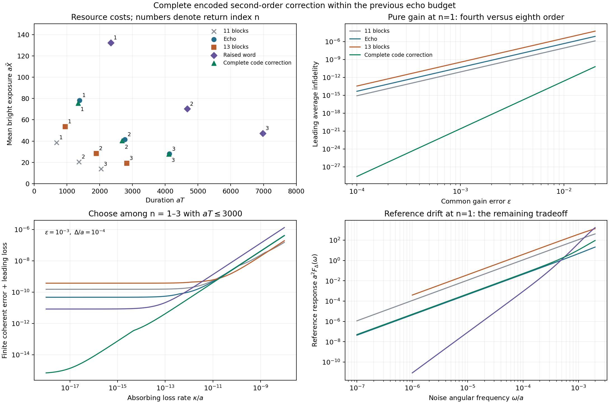

# Complete encoded correction within the echo budget

The remaining second-order leakage target is closed at $n=1,2,3$. Certified words with **17, 19 and 21 blocks**, respectively, each use less than the previous echo's duration multiplier $W=24$. They cancel the complete second-order encoded response to common gain error and static reference detuning. An additional signed-moment condition improves pure-gain infidelity from fourth to **eighth order**.

The extension supplies two general results: the real dimension of the first surviving response under time-reflection symmetry, and an order-doubling theorem for a primitive with a fixed reference. The complete leading joint error and remaining temporal response are computed below.

Inputs: [CP-1–4](2026-09-05-reflection-loop-composite-control.md), [CM-1–5](2026-09-05-reflection-loop-compression.md), [SD-1–6](2026-09-05-reflection-loop-second-order-detuning.md), and the native [REALFIBER proof](</home/williaml/Cella Framework/Papers_Library/02_theorems_and_lemmas/geometric_fault_localization_and_decomposition/REALFIBER_THEOREM.md>). The Cella DAG's GFL:thm:realfiber node and backing proof were checked before extending this material.

## SC-1. The real space of a leading response

Let $P=\operatorname{span}(d,r)$, $Q=\operatorname{span}(e_1,e_2)$,

\[
G=\operatorname{diag}(-1,1),\quad
J=\begin{pmatrix}0&1\\1&0\end{pmatrix}\bigg|_Q,\quad
B=Je^{-2i\theta J},\quad \theta=\pi/3,\quad K=B\oplus G.
\tag{1}
\]

Consider any analytic unitary family with $U_0=K$ and
$U_\lambda^T=\mathcal J U_\lambda\mathcal J$, where $\mathcal J=J\oplus I_P$. Suppose all encoded errors below order $q$ are common phase. Remove that phase and write the first surviving code coefficient as

\[
e^{-i\phi(\lambda)}U_\lambda P
=KP+\lambda^q\begin{bmatrix}X\\GA\end{bmatrix}+O(\lambda^{q+1}),
\qquad \operatorname{tr}A=0.
\tag{2}
\]

**Leading-response theorem.** There are a real $2\times2$ matrix $R$ and real scalars $y,z$ such that

\[
\boxed{X=e^{-i\theta J}R\operatorname{diag}(1,i),\qquad
A=\begin{pmatrix}iz&y\\-y&-iz\end{pmatrix}.}
\tag{3}
\]

Thus the full leading encoded response has **six real coordinates**, at every first surviving order.

**Proof.** Unitarity gives $A^\dagger=-A$. Transpose symmetry makes $GA$ symmetric, yielding the second formula in (3). In the off-diagonal blocks, all lower-order code terms have vanished after phase removal, so unitarity and transpose symmetry give

\[
B^\dagger X+JX^*G=0
\quad\Longleftrightarrow\quad
e^{2i\theta J}X+X^*G=0.
\tag{4}
\]

For the $G=-1$ column, $e^{i\theta J}X$ is real; for the $G=+1$ column it is purely imaginary. This proves the first formula. No particular primitive trajectory entered the argument.

The leading average infidelity is consequently

\[
\boxed{1-F_{\rm av}
=\lambda^{2q}\left[\frac12\|R\|_F^2+\frac23(y^2+z^2)\right]
+O(\lambda^{2q+1}).}
\tag{5}
\]

**General dimensions.** For a code of dimension $d$ with real symmetric reflection $G$ and a bright sector of dimension $b$ with real symmetric involution $J$, the same hypotheses give

\[
\dim_{\mathbb R}(\text{leading encoded response})
=bd+\frac{d(d+1)}2-1.
\tag{6}
\]

Indeed, $X\mapsto-BJX^*G$ is an antilinear involution: $B^T=JBJ$ and unitarity imply $BJ B^*J=I$. Its fixed space has real dimension $bd$, since any vector decomposes uniquely into a fixed vector plus $i$ times a fixed vector. The equations $A^\dagger=-A$, $(GA)^T=GA$ give $d(d+1)/2$ real logical coordinates, with one removed for common phase.

There is also an odd-parity version. If
$U_\lambda^T=\mathcal J U_{-\lambda}\mathcal J$ and the first surviving order $q$ is odd, then $(GA)^T=-GA$. The dimension becomes
$bd+d(d-1)/2$. For the present two-plus-two system this is **five** coordinates. An odd time-dependent perturbation of a time-reflection-symmetric real Hamiltonian has exactly this symmetry; linear reference drift is an example.

## SC-2. A general gain-order doubling theorem

Let an analytic unitary primitive $C_\epsilon$ fix $r$ exactly, have nominal endpoint $B_0\oplus G$, and satisfy
$C_\epsilon P=GP+O(\epsilon^p)$ for an integer $p\ge1$. The bright endpoint may vary at lower orders.

Use an odd alternating word with $\sigma_j=(-1)^{j-1}$, physical angles

\[
\alpha_j=2\sum_{k<j}\sigma_k\beta_k+\sigma_j\beta_j,
\qquad \sum_j\sigma_j\beta_j\in\pi\mathbb Z.
\tag{7}
\]

A positive-sign block is $O_{\alpha_j}C_\epsilon O_{\alpha_j}^T$; a negative-sign block is its inverse. Stretches do not change this common-gain endpoint. Impose

\[
\boxed{\sum_j\sigma_je^{i\beta_j}=0,\qquad
\sum_j\sigma_je^{2i\beta_j}=0.}
\tag{8}
\]

**Order-doubling theorem.** The resulting encoded error amplitude, after common phase removal, is $O(\epsilon^{2p})$. Its pure-gain infidelity is $O(\epsilon^{4p})$.

**Proof.** Unitarity makes the opposite leakage block $O(\epsilon^p)$ as well. Normalize the bright block by its positive Gram square root to obtain a unitary $B_\epsilon$. Then
$C_\epsilon=(B_\epsilon\oplus G)\exp Z_\epsilon$ with $\|Z_\epsilon\|=O(\epsilon^p)$, $Z_\epsilon^\dagger=-Z_\epsilon$, and $Z_\epsilon r=0$. Write its leading code column as $(L_\epsilon,\ i\varphi_\epsilon,\ 0)^T$, where $L_\epsilon$ is a bright vector and $\varphi_\epsilon$ is real.

For $u_\beta=(\cos\beta,\sin\beta)^T$, the first variation of the alternating product on the code is

\[
\begin{bmatrix}
L_\epsilon\sum_j\sigma_ju_{\beta_j}^T\\
i\varphi_\epsilon\sum_j\sigma_ju_{\beta_j}u_{\beta_j}^T
\end{bmatrix}.
\tag{9}
\]

The bright factors cancel between successive forward and inverse blocks, for any $B_\epsilon$, as in CM-1. A bright-only first variation has no code column. Conditions (8) make the top block zero and the lower block $i\varphi_\epsilon I_P/2$, since $\sum_j\sigma_j=1$. Removing that common phase leaves the quadratic remainder $O(\|Z_\epsilon\|^2)=O(\epsilon^{2p})$. The unitary fidelity identity then gives the claimed order.

The native primitive has $p=2$. CM already imposed the second harmonic in (8); the first harmonic is the additional condition. It cancels the entire second- and third-order gain leakage, while the projected phase remains common through cubic order. This yields

\[
\boxed{1-F_{\rm av}(\epsilon,0)=A_g\epsilon^8+O(\epsilon^9).}
\tag{10}
\]

This theorem applies to every native return index. The reference-detuning conditions below determine which controls accompany each index.

## SC-3. Fifteen equations and certified finite controls

Use antisymmetric $\beta$ and symmetric stretches:

\[
\beta=(b_1,\ldots,b_h,0,-b_h,\ldots,-b_1),\quad
s=(w_1,\ldots,w_h,w_0,w_h,\ldots,w_1),\quad N=2h+1.
\tag{11}
\]

The eight real CM conditions impose the six-generator static correction and second signed harmonic. Add the first signed harmonic from (8), and the six real second-order reference-response coordinates from (3). This is a system of **fifteen real equations**.

These conditions retain first-order correction for every Hermitian
$V\in\operatorname{End}(Q)\oplus\mathbb C D_d\oplus\mathbb C D_r$, the mixed gain–noise cancellation and scalar first-order erasure. For the reference detuning specifically, they remove the entire second-order encoded error, including leakage. They do not impose the whole-Hilbert-space quadratic noise-log identity of SD-3; that general construction remains available.

At $\nu/a^2=10$, [the control records](reflection-loop-short-controls.json) specify the following exact nearby roots:

| Return $n$ | Blocks $N$ | Total stretch $W$ | Physical stages |
|---:|---:|---:|---:|
| 1 | 17 | 23.183601287875103 | 289 |
| 2 | 19 | 23.305949900675145 | 323 |
| 3 | 21 | 23.899318019840862 | 357 |

Each profile is separately certified. The $n=1$ detuning solution is not transferred unchanged to the higher returns.

**Certificate.** Fix the recorded 2, 4 or 6 unit stretches, leaving fifteen free coordinates. The finite Fourier formulas of SD-1 evaluate the equations directly. On the radius-$10^{-35}$ cube around each 65-digit center, all stretches remain in $[1,3)$. For $N\le23$, normalized response second partials are bounded by

\[
\left[4(2N+4)+2\right]^2(3N)^2/2<10^8.
\tag{12}
\]

The circular bounds are smaller. The interval calculation retains the conservative bound $10^{18}$, encloses the residual and Jacobian, and verifies contraction of $x\mapsto x-Af(x)$ as in SD-2. Contraction bounds at the three indices are below $2.0\times10^{-12}$, $2.8\times10^{-12}$ and $1.86\times10^{-11}$; center displacements are below $4.6\times10^{-65}$. Hence each cube contains a unique exact root with the fixed controls.

Numerical constrained search located these centers; the interval argument establishes existence. Global duration optimality remains open.

All rotations specify physical couplings. Negative backward blocks and stretches preserve the native real zero-diagonal rank-two family, amplitude/slew bounds and nominal parallel transport. Entry, exit and sign ramps are included, with the attached code plane retained at zero-Hamiltonian joins.

## SC-4. Complete joint leading response

Let $\delta=\Delta/a$ and expand the physical endpoint as
$U_{\epsilon,\delta}=\sum_{p,q}\epsilon^p\delta^qU_{pq}$. All bad code coefficients of total degree one or two vanish. SC-2 also removes the pure-gain coefficient $(3,0)$.

For the code-error vector

\[
\mathcal B(M)=\left(
\frac{\operatorname{vec}(QMP)}{\sqrt2},
\frac{\operatorname{vec}(\operatorname{tf}_P PMP)}{\sqrt3}\right),
\quad e_{pq}=\mathcal B(K^\dagger U_{pq}),
\tag{13}
\]

the complete leading joint infidelity is

\[
\boxed{1-F_{\rm av}(\epsilon,\delta)
=\delta^2\|\epsilon^2e_{21}+\epsilon\delta e_{12}+\delta^2e_{03}\|^2
+O((|\epsilon|+|\delta|)^7).}
\tag{14}
\]

Put $z=(\epsilon^2,\epsilon\delta,\delta^2)^T$ and
$\Gamma_{ij}=\langle e_i,e_j\rangle$, with $i,j\in\{21,12,03\}$. Equation (3) makes $\Gamma$ real; it is positive semidefinite as a Gram matrix. All three certified profiles give positive-definite $\Gamma$, so

\[
\lambda_{\min}(\Gamma)\delta^2(\epsilon^4+\epsilon^2\delta^2+\delta^4)
\le (1-F_{\rm av})_{(6)}
\le \lambda_{\max}(\Gamma)\delta^2(\epsilon^4+\epsilon^2\delta^2+\delta^4).
\tag{15}
\]

For $n=1$, the Gram matrix is approximately

\[
\Gamma=
\begin{pmatrix}
66971.4442&-116022.408&23538.6446\\
-116022.408&967752.879&3343172.60\\
23538.6446&3343172.60&25061894.8431
\end{pmatrix}.
\tag{16}
\]

Its smallest eigenvalue is approximately $37580.57$. The receipt supplies full matrices and eigenvalues for all three indices.

**Arbitrary joint order.** The SD exponential-polynomial algebra now carries two perturbation powers. For each native arc, the interaction-frame gain kernel is itself a finite Fourier sum:

\[
M_g(u)=F(0)\sum_{m,l}\Pi_mJ_4\Pi_l\,e^{i4n(m-l)u}F(0)^T.
\tag{17}
\]

Together with the reference kernel $M_r(u)$ from SD-1, this gives

\[
E_{pq}(u)=-\frac{i}{v}\int_0^u
\left[M_g(t)E_{p-1,q}(t)+M_r(t)E_{p,q-1}(t)\right]dt.
\tag{18}
\]

Negative-index coefficients are zero. SD-1's integration rule closes (18) at any order, including resonances. Holds use their exact signed area for gain and actual duration for detuning. Their two generators have orthogonal supports, so mixed hold coefficients vanish. A physical inverse maps $U_{pq}$ to $(-1)^qU_{pq}^\dagger$; stretching multiplies it by $s^q$. The runner computes every joint coefficient through total degree four and verifies them against an independent laboratory ODE.

Equation (14) is the complete degree-six infidelity. Equation (10) separately gives the leading pure-gain term; combining the two does not constitute a full joint degree-eight expansion.

## SC-5. Duration, exposure and finite errors

With $T_c$ and $X_c$ from SD-5,

\[
T=WT_c,\qquad \bar X=WX_c/2,\qquad
p_{\rm loss}=\kappa\bar X+O(\kappa^2).
\tag{19}
\]

The first-order loss is state-independent on encoded inputs under the existing absorbing-sink model. Since the previous echo has $W=24$, both duration and exposure ratios to that echo are $W/24$ at the same return.

| $n$ | $aT$ | $a\bar X$ | Duration/exposure relative to echo |
|---:|---:|---:|---:|
| 1 | 1338.395 | 75.617 | 96.598% |
| 2 | 2684.555 | 40.383 | 97.108% |
| 3 | 4111.475 | 27.912 | 99.580% |

The coefficients in the two pure-error limits are:

| $n$ | $A_g$ in $A_g\epsilon^8$ | $A_\Delta$ in $A_\Delta\delta^6$ |
|---:|---:|---:|
| 1 | 2500.46374 | $2.50618948\times10^7$ |
| 2 | 41177.2706 | $1.37717406\times10^{11}$ |
| 3 | 33290.2438 | $1.95202658\times10^9$ |

The profiles differ, so their residual coefficients need not vary monotonically with $n$. The separate finite-error calculation, including all physical durations, gives:

| $n$ | Infidelity at $\epsilon=10^{-3},\delta=10^{-4}$ | Infidelity at $\epsilon=10^{-3},\delta=10^{-3}$ |
|---:|---:|---:|
| 1 | $6.32546\times10^{-16}$ | $3.17417\times10^{-11}$ |
| 2 | $1.68127\times10^{-13}$ | $1.36812\times10^{-7}$ |
| 3 | $7.92531\times10^{-15}$ | $1.61903\times10^{-9}$ |

At the first point, the new $n=1$ gate improves finite coherent error by approximately $1.33\times10^4$ relative to the raised eleven-block gate, using 57.176% of its duration/exposure. This comparison concerns common gain and static reference detuning.

For a duration limit $aT\le3000$, compare the recorded families at $n=1,2,3$ using $I_{\rm coherent}+(\kappa/a)(a\bar X)$. At the same first point, $\kappa/a=10^{-15}$ selects the new $n=1$ gate and improves the previous best estimate by $112$ times; $\kappa/a=10^{-13}$ selects the new $n=2$ gate and improves it by $5.14$ times. At $\kappa/a=10^{-10}$ or $10^{-9}$, the thirteen-block $n=3$ gate remains the best of this candidate set. These weak-loss comparisons omit mixed loss/error corrections.

## SC-6. Temporal response and the next target

The new controls retain constant and linear gain-drift cancellation:
$F_g(\omega)=O(\omega^4)$. Constant reference detuning is corrected, while
$F_\Delta(\omega)=O(\omega^2)$. At $n=1,a=1,\nu=10$,

\[
F_g(\omega)\sim5.28798231\times10^8\omega^4,\qquad
F_\Delta(\omega)\sim5.10555881\times10^6\omega^2.
\tag{20}
\]

The full gain/reference temporal Gram matrices, including cross-correlations, are in the receipt. SD-3's longer raised construction retains higher temporal orders, $F_g=O(\omega^6)$ and $F_\Delta=O(\omega^4)$, as well as its wider quadratic noise-log identity.

**Next target:** cancel affine reference drift while retaining the fifteen static/gain equations and $W\le24$. SC-1 reduces that leading odd-time response to five real coordinates. This supplies an explicit twenty-equation target for the next control construction.

[Response runner](../reflection_loop_short_correction.py) · [interval certificate](../reflection_loop_detuning_certificate.py) · [124-check receipt and full matrices](reflection-loop-short-checks.json) · [controls](reflection-loop-short-controls.json).

The checks include three root certificates, every retained static-noise generator, all joint coefficients through degree four, generic bright-dynamics witnesses of SC-2, finite-error convergence, physical joins, temporal orders and loss response. The previous SD runner's 105-check gate also passes after generalizing the certificate interface.

## SC-7. Comparison with the endpoint-erasure construction

[SPLIT-1](2026-09-05-CLAIRE-split-loop.md) supplies a separate heralded route: project onto the returned code after each of three primitive loops. Its gain-only response admits an exact reduction. Let $z(\epsilon)$ be the active code return amplitude of one RF loop, so $z(0)=-1$, while the reference amplitude is exactly one. Each projected loop is

\[
M_\alpha=O_\alpha\operatorname{diag}(z,1)O_\alpha^T.
\]

For the physical angles $(\pi/3,2\pi/3,\pi/3)$, put $t=z+1$ and $K_s=M_{\pi/3}M_{2\pi/3}M_{\pi/3}$. Direct multiplication gives the all-orders identity

\[
\boxed{G K_s=c(t)I+
\begin{pmatrix}
-t^3/8&\sqrt3\,t^2(2-t)/16\\
-\sqrt3\,t^2(2-t)/16&t^3/8
\end{pmatrix},\qquad
c(t)=1-\frac32t+\frac38t^2+\frac1{16}t^3.}
\tag{21}
\]

RF's primitive has $t=(5b^2/2)\epsilon^2+O(\epsilon^3)$, where $b=(\pi/2)(1-1/(16n^2))$. Thus the scalar attenuation starts at second order in gain, while the surviving nonscalar amplitude starts at fourth order. With ideal projections,

\[
\bar p_{\rm erase}=\frac{15b^2}{2}\epsilon^2+O(\epsilon^3),\qquad
1-F_{\rm conditional}=\frac{625b^8}{512}\epsilon^8+O(\epsilon^9).
\tag{22}
\]

The leading conditional formula holds both for equal weighting of input states and for weighting by success probability. For an exact success-weighted value, write $G K_s=cI+R$ with $\operatorname{tr}R=0$; Haar integration gives $2\|R\|_F^2/[3\operatorname{tr}(K_s^\dagger K_s)]$. Dividing $\|R\|_F^2/3$ by the extreme eigenvalues of $K_s^\dagger K_s$ bounds the equally weighted conditional average without sampling.

An 80-digit evaluation of the RF moving-frame formula at $n=1,\epsilon=0.01$ gives mean erasure $0.00159176465538$, full state-to-state erasure spread $2.23200153\times10^{-8}$, and success-weighted conditional infidelity $2.49506592\times10^{-15}$. At $\epsilon=0.001$ the conditional value is $2.68017415\times10^{-23}$. The projected matrix agrees with an independent integration of SPLIT-1's laboratory Hamiltonian. This explains the numerical witness as a definite suppression order and quantifies its residual state dependence.

The loop time is $9\tau_1=54.7530/a$, before any dump time. This is a substantial resource opportunity if heralded loss is acceptable. The existing SPLIT-1 runner still gives conditional infidelity $2.34\times10^{-8}$ at $\epsilon=10^{-3},\Delta/a=10^{-4}$ for its declared site detuning. For a stationary code with $HP=0$, ideal selective absorption has no-jump map $P+e^{-\kappa t_d/2}V_QQ$, where $V_Q$ is the bright-sector unitary; its surviving bright amplitude and duration can therefore be included explicitly.

**Completed continuation:** [FD-1–6](2026-09-05-reflection-loop-finite-dumps.md) constructs a five-loop sequence that cancels first-order logical detuning with finite dumps included. Its full no-click and flag responses, mixed errors, finite duration and return-index/transport-loss comparisons are evaluated. The next heralded-control target is quadratic correction of that full instrument.
