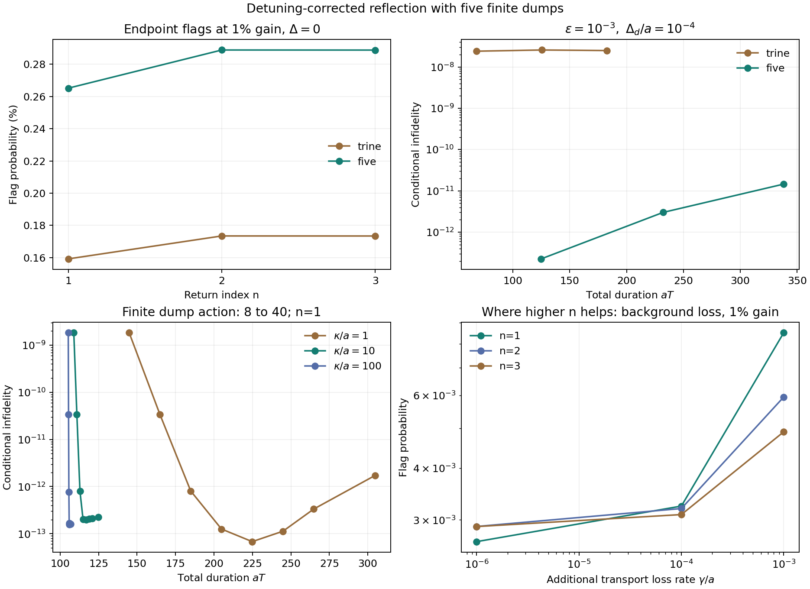

# Five-loop detuning correction with finite dumps

**Result.** Three forward native return loops and an orthogonal pair of stretched inverse loops cancel the first-order logical response to both code-site detunings and arbitrary Hermitian bright-sector noise. Every loop ends with a finite absorbing hold. At $n=1$, $\kappa/a=10$ and dump action $\kappa t_d=40$, the full duration is $aT=124.8735$. With $\epsilon=10^{-3}$ and $\Delta_d/a=10^{-4}$, conditional infidelity is $2.24985\times10^{-13}$ and flagged erasure is $2.69845\times10^{-5}$. Surviving bright population is included in the conditional error.

Inputs: the native REALFIBER proof O1–O7, [RF finite returns](2026-09-05-reflection-loop-finite-duration.md), [the existing finite ramps](2026-09-05-reflection-loop-reference-echo.md), [SPLIT-1](2026-09-05-CLAIRE-split-loop.md), and [SC-7's projected gain map](2026-09-05-reflection-loop-complete-code-correction.md#sc-7-comparison-with-the-endpoint-erasure-construction). No external search or mathematical import was used.

## FD-1. The actual finite sequence

Use $a=1$ in the runner; frequencies, rates and times below are in these units. The code is $P=\operatorname{span}(d,r)$, the bright plane is $Q$, and the target is $G=\operatorname{diag}(-1,1)|_P$. The primitive consists of RF's three constant-speed arcs at return $n$, with the existing zero-area entry/exit ramps. Put

\[
\tau_n=\frac\pi2\sqrt{16n^2-1},\quad
t_{\rm ramps}=\frac{2(1+\sqrt2)}{\nu},\quad
T_0=3\tau_n+t_{\rm ramps},\quad \nu=10.
\tag{1}
\]

Chronological controls are:

| Loop | Physical angle $\alpha$ | Direction | Stretch |
|---:|---:|---|---:|
| 1 | $\pi/6$ | Forward | $1$ |
| 2 | $5\pi/6$ | Forward | $1$ |
| 3 | $7\pi/6$ | Forward | $1$ |
| 4 | $3\pi/4$ | Inverse | $s=3\sqrt3/4$ |
| 5 | $\pi/4$ | Inverse | $s=3\sqrt3/4$ |

Stretching replaces $H(t)$ by $H(t/s)/s$. An inverse uses the negative time-reversed control; uncontrolled detuning keeps its laboratory sign. Angles rotate the physical couplings, with no instantaneous logical gates. Every loop starts and ends at $H=0$, and all joins, amplitude and slew conditions are retained.

After **every** loop, including the last, hold $H=0$ and activate absorption into orthogonal monitored bright sinks for time $t_d$. Each absorption flags the run. During transport the absorber is off. The finite no-click dump is

\[
D=\chi Q+e^{-it_d(\delta_dD_d+\delta_rD_r)}P,
\qquad \chi=e^{-\kappa t_d/2},\quad D_d=|d\rangle\langle d|,
\quad D_r=|r\rangle\langle r|.
\tag{2}
\]

Detuning persists during all ramps, arcs and dumps. The complete no-click map is
$K=D U_5D U_4D U_3D U_2D U_1$. No projection is applied to its output. Its total time is

\[
T=(3+2s)T_0+5t_d.
\tag{3}
\]

The main run uses $\kappa=10,t_d=4$, so $\chi=e^{-20}$. The receipt also evaluates actions 8–40 at rates 1, 10 and 100. These rates specify the declared model; they are not a hardware feasibility claim.

## FD-2. Why five loops cancel detuning

Let $A(V)=\int U_0(t)^\dagger VU_0(t)\,dt$ be the primitive interaction-frame response. Restricted to $P$, the native loop gives

\[
A(D_d)=\mu D_d,\qquad A(D_r)=T_0D_r,\qquad
A(X_{dr})=b_nY,
\tag{4}
\]

where $X_{dr}=|d\rangle\langle r|+|r\rangle\langle d|$,
$Y=\begin{pmatrix}0&-i\\i&0\end{pmatrix}$,
$\mu=\tau_n+t_{\rm ramps}$ and
$b_n=(\pi/2)(1-1/(16n^2))$.

For completeness, write $v=1/(4n)$ and $u=\sqrt{1-v^2}$. The first and third arcs contribute opposite real integrals to the cross response. On the middle arc, the active return amplitude is $iuv(1-\cos(4n\theta))$, so its conjugate integrates to $-iuv\tau_n=-ib_n$. The two outer arcs' squared amplitudes integrate to $\tau_n(1-3v^2/2+3v^4/2)$; the middle contributes $3\tau_n(v^2-v^4)/2$. Their sum is exactly $\tau_n$. The stationary ramps add their duration to $\mu$ and cancel in the cross response. This proves (4) at every integer return.

For angle $\alpha$, the $d$-site response is the rotation of
$\mu\cos^2\alpha\,D_d+T_0\sin^2\alpha\,D_r-b_n\sin\alpha\cos\alpha\,Y$.
For an inverse loop, conjugate that response by its nominal reflection. Transporting each response back through its preceding reflections, the two groups give

\[
\begin{aligned}
\operatorname{tf}\sum_{j=1}^{3}A_j(D_d)&=-\frac{3\sqrt3}{4}b_nY,\\
\operatorname{tf}\sum_{j=4}^{5}A_j(D_d)&=s b_nY.
\end{aligned}
\tag{5}
\]

Thus $s=3\sqrt3/4$ cancels the full traceless logical response. The $r$-site terms have opposite $Y$ signs and cancel at the same stretch. These identities hold for arbitrary $\mu,T_0,b_n$ with response structure (4); the construction is not fitted to a particular $n$.

The five preceding reflections also give

\[
\sum_{j=1}^5 R_j^TD_dR_j=\frac52I_P.
\tag{6}
\]

Consequently **equal finite dump times contribute only common phase** at first order, for either site detuning. For any Hermitian $V$ supported in $Q$, the primitive code response is a real scalar times the active-line projector. The forward triple and inverse pair each form a tight frame, so their summed response is scalar too. This proves first-order logical correction for all six generators of $\operatorname{Herm}(Q)\oplus\mathbb R D_d\oplus\mathbb R D_r$.

Finite $\chi$ does not change this logical first-order proof: every nominal loop and dump preserves $P$ and $Q$ separately, so a first-order bright amplitude cannot re-enter $P$ under subsequent nominal blocks. It remains in the full no-click map and is counted below.

## FD-3. Gain conversion and the finite-dump floor

For ideal projection only, let $z(\epsilon)$ be the primitive active return amplitude. The orthogonal inverse pair has projected product $z^*I_P$ exactly. The forward triple is a fixed real orthogonal conjugate of SPLIT-1's trine. Writing $S=\begin{pmatrix}0&1\\1&0\end{pmatrix}$,

\[
K_{5,\mathrm{ideal}}=z^*S K_{3,\mathrm{ideal}}S.
\tag{7}
\]

Hence its conditional gain fidelity equals the trine's **at every gain value with nonzero success probability**. Its success probability is multiplied by $|z|^2$. In particular,

\[
\bar p_{5,\mathrm{erase}}=\frac{25}{2}b_n^2\epsilon^2+O(\epsilon^3),
\qquad
1-F_{5,\mathrm{conditional}}=\frac{625b_n^8}{512}\epsilon^8+O(\epsilon^9).
\tag{8}
\]

The finite-dump run uses (2), not (7). At fixed nonzero $\chi$, its first-order bright response is nonzero. For gain, a direct product bound is

\[
\|Q\partial_\epsilon K(0)P\|
\le \chi\sqrt5\,b_n\sum_{j=0}^{4}\chi^j
\le\frac{\chi\sqrt5\,b_n}{1-\chi}.
\tag{9}
\]

The first inequality uses the operator norm of each primitive gain-leakage column and the nominal bright contraction of every later dump. Thus incomplete removal contributes a small quadratic error floor, even when the logical response has higher order. At $n=1,\kappa t_d=40$, the computed mean bright coefficients are $2.30326\times10^{-17}\epsilon^2$ and $1.02308\times10^{-18}\delta_d^2$, with their mixed term retained in the full coefficient matrices. Eighth-order gain and quartic detuning describe the observed regime above this floor, not the strict asymptote at fixed finite dump strength.

## FD-4. Full instrument and joint response

For lossless loops, let $L_j=U_jD U_{j-1}\cdots D U_1$ denote evolution up to the $j$th dump. The summed flag effect is

\[
E_{\rm flag}=(1-\chi^2)\sum_j L_j^\dagger QL_j,
\qquad K^\dagger K+E_{\rm flag}=I.
\tag{10}
\]

This identity includes every input state and every finite error. The runner also includes transport loss when requested, adding its effects $K_{j-1}^\dagger(I-U_j^\dagger U_j)K_{j-1}$ before each dump effect.

Put $A=GK_{PP}$, $B=K_{QP}$, $A_0=A-\operatorname{tr}(A)I/2$ and
$p_s=(\|A\|_F^2+\|B\|_F^2)/2$. The exact Haar average weighted by success is

\[
\boxed{1-F_{\rm conditional}
=\frac{\|B\|_F^2/2+\|A_0\|_F^2/3}{p_s},\qquad
\bar p_{\rm erase}=\frac12\operatorname{tr}_P E_{\rm flag}.}
\tag{11}
\]

The numerator is evaluated directly, avoiding subtraction from unit fidelity. Dividing it by the largest and smallest eigenvalues of $PK^\dagger KP$ bounds the equally weighted conditional average. The receipt provides these bounds and the full state-to-state flag spread.

The existing finite Fourier algebra now composes the bare-loop joint gain/detuning coefficients with the exact dump coefficients
$D_{0q}=(-it_d)^qD_d/q!$ for $q\ge1$, $D_{00}=P+\chi Q$, and $D_{pq}=0$ for $p>0$. The convolution closes at arbitrary joint order. All coefficients through total degree four are stored and compared with finite laboratory evolution. The first-order logical cancellation and the remaining bright coefficient are independently checked by quadrature for all six static generators.

## FD-5. Runs and the return-index lever

At $\kappa/a=10$, $\kappa t_d=40$, with no additional transport loss:

| $n$ | Full duration $aT$ | Erasure at 1% gain, zero detuning | Conditional infidelity at $\epsilon=10^{-3},\delta_d=10^{-4}$ |
|---:|---:|---:|---:|
| 1 | 124.8735 | 0.265153% | $2.24985\times10^{-13}$ |
| 2 | 232.0902 | 0.288862% | $3.00263\times10^{-12}$ |
| 3 | 338.1656 | 0.288808% | $1.45690\times10^{-11}$ |

At 1% gain with zero detuning, conditional infidelities are $2.49522$, $3.57080$ and $3.66382$ times $10^{-15}$. The matched three-loop construction, with the same finite dumps and ramps, gives $2.40807\times10^{-8}$ at the mixed-error test point for $n=1$, versus $2.24985\times10^{-13}$ here: approximately $1.07\times10^5$ improvement for a duration increase from $68.2015/a$ to $124.8735/a$.

At that mixed-error point, the new gate's mean erasure is $2.69845\times10^{-5}$ and its state-to-state spread is $9.86512\times10^{-7}$. The leading gain-only flag is scalar; mixed-error state dependence remains a target for the next instrument correction.

**What the $n$ lever changes.** The endpoint flag rate is determined by $z(\epsilon)$, not by the time integral of bright population. For the original trine it starts at $(15/2)b_n^2\epsilon^2$, and the finite-dump sweep gives **0.159176%, 0.173417%, 0.173385%** at 1% gain. These values explain why doubling $n$ does not halve endpoint erasure. Residual detuning error also changes with $n$, as the table shows.

The integrated exposure remains useful for additional bright absorption during transport. For a weak background rate $\gamma$,

\[
\bar p_{\rm background}=\gamma\bar X_n+O(\gamma^2),\quad
\bar X_n=\frac{3+2s}{2}X_n,\quad
X_n=3\tau_n\left(\frac{2}{16n^2}-\frac{3}{2(16n^2)^2}\right)
\sim\frac{3\pi}{4n}.
\tag{12}
\]

The nominal exposures are $6.08633$, $3.23334$ and $2.17930$ for the five-loop sequence. The slope is checked directly with finite absorbing evolution. With 1% gain and $\gamma/a=10^{-3}$, the full simulated absorption probabilities are **0.851286%, 0.594991%, 0.490018%**: higher $n$ helps in this regime. If both absorbing ports are monitored, their conditional infidelities are $1.97\times10^{-13}$, $5.14\times10^{-14}$ and $2.53\times10^{-14}$. Unmonitored background outcomes remain in the accepted ensemble; FD-7 gives that readout and its operating-point pairs.

The dump sweep retains duration as a variable. At $\kappa/a=10$, action 24 gives $aT=116.8735$ and mixed-error conditional infidelity $1.99502\times10^{-13}$; its pure-gain floor at 1% is higher than at action 40. These are comparisons within the stated family and test points, not global optima.



## FD-6. Replay and continuation

[Runner](../reflection_loop_finite_dump.py) · [receipt and full joint matrices](reflection-loop-finite-dump-checks.json) · [dependency ledger](EXTERNAL-MATHEMATICS-DEBT.md).

All **139 numerical checks and six symbolic identities pass**. They cover all three returns; the six static logical responses; the complete finite no-click map; gain endpoints; mixed coefficients and detuning scaling; probability conservation and flag positivity; direct chronological dump integration; integration convergence; physical joins; and the nominal background-loss law. FD-7 is checked against independent density-matrix evolution with separate absorbing registers, together with the zero-background and fully monitored limits. The independent laboratory integrations include the negative time-reversed controls and absorbing dumps explicitly.

```bash
OPENBLAS_NUM_THREADS=1 python3 rlq/reflection_loop_finite_dump.py --json docs/reflection-loop-finite-dump-checks.json --plot docs/reflection-loop-finite-dump-tradeoffs.png
```

**Next target:** cancel the quadratic full-instrument response: the remaining logical detuning/mixed-gain distortion and state dependence of the flag effect, while retaining the finite dump and its duration. The five-loop construction supplies the baseline and exact response matrices for that extension.

## FD-7. The pair when background absorption is unheralded

The figure now supplies **total absorption** and the paired coordinates $(p_h,q_u)$ at the same operating point. Dump absorption is monitored; background absorption during transport enters unobserved terminal sinks. There is no later flag for those background events in this readout model.

Separate the two positive loss effects as $E_d$ and $E_b$. Direct integration of
$\gamma\int U(t)^\dagger Q(t)U(t)\,dt$ obtains the latter without subtracting nearly equal unit matrices. They obey

\[
K^\dagger K+E_d+E_b=I.
\tag{13}
\]

More generally, if fractions $\eta_d,\eta_b\in[0,1]$ of these terminal events are recorded, then

\[
E_h=\eta_dE_d+\eta_bE_b,\qquad
E_u=(1-\eta_d)E_d+(1-\eta_b)E_b.
\tag{14}
\]

The plotted readout uses $\eta_d=1,\eta_b=0$. Define
$p_h=\operatorname{tr}_P(E_h)/2$ and $p_u=\operatorname{tr}_P(E_u)/2$. The accepted ensemble contains both the surviving state and unobserved absorbed outcomes. With $A,B,A_0$ as in (11), its exact residual is

\[
\boxed{q_u=
\frac{p_u+\|B\|_F^2/2+\|A_0\|_F^2/3}{1-p_h}.}
\tag{15}
\]

Thus the requested pair is $(p_h,q_u)$; **total absorption is $p_h+p_u$**, and the residual per attempted run is $(1-p_h)q_u$. Unobserved absorption contributes error even when the conditional surviving state is accurate. In particular, $q_u\ge p_u/(1-p_h)$ exactly.

The receipt also supplies the conditional Bell-pair infidelity,
$[p_u+\|B\|_F^2/2+\|A_0\|_F^2/2]/(1-p_h)$, to keep the reference-entangled convention distinct from the average input-state convention in (15). It retains each code map and both loss effects, including their state dependence, for threshold calculations with a chosen code and noise model.

**Operating points to quote.** All rows below use $n=1$, $\kappa/a=10$, $\kappa t_d=40$, $aT=124.8735$, $\Delta_d/a=10^{-4}$, $\Delta_r=0$, monitored dumps and unmonitored background absorption:

| Gain error $\epsilon$ | Background $\gamma/a$ | Heralded fraction $p_h$ | Unheralded residual $q_u$ |
|---:|---:|---:|---:|
| $10^{-3}$ | $0$ | 0.00269845% | $2.24985\times10^{-13}$ |
| $10^{-3}$ | $10^{-6}$ | 0.00269841% | $6.06981\times10^{-6}$ |
| $10^{-2}$ | $0$ | 0.265058% | $3.47408\times10^{-12}$ |
| $10^{-2}$ | $10^{-6}$ | 0.265055% | $5.93456\times10^{-6}$ |
| $10^{-2}$ | $10^{-4}$ | 0.264728% | $5.93144\times10^{-4}$ |

The starred point on the figure is therefore **$(0.265055\%,\ 5.93456\times10^{-6})$**, with the 1% gain and $\gamma/a=10^{-6}$ conditions above. Its total absorption is 0.265647%. At the lower-gain zero-background point, the unobserved contribution reaches the surviving-state floor around $\gamma/a=3.71\times10^{-14}$. This identifies when further coherent correction affects the total residual and when reducing exposure or improving loss monitoring is the relevant extension.

The paired curves cover both gain values at $n=1,2,3$ and background rates from zero through $10^{-3}a$. A direct density-matrix calculation on six qubit input states, with separate dump and background registers, verifies (15) and its probability partition without conditioning away the unobserved events.
